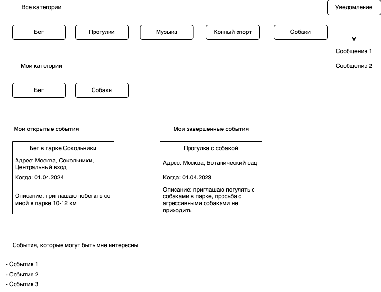
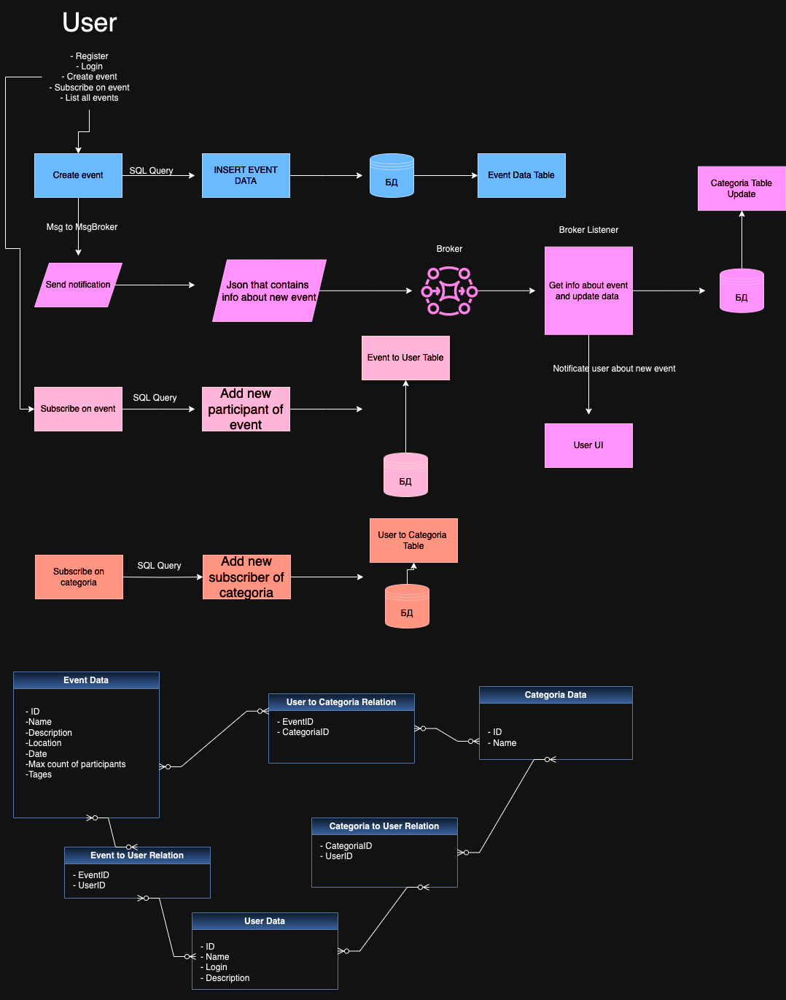

# WeakCon (Weak Connections)
 - Краткое описание проекта: проект представляет собой платформу для поиска единомышленников по интересам.
 - Целевая аудитория: все, кто хочет найти людей по интересам.
# Описание MVP
 - Регистрация и профили пользователей: Пользователи могут создавать учетные записи, заполнять профили и выбирать категории событий, которые их интересуют.
 - Публикация событий: Пользователи могут создавать события, указывая заголовок, описание, дату, время, местоположение и категорию события.
 - Лента событий: Отображение всех опубликованных событий в хронологическом порядке или с учетом интересов пользователей (например, на основе подписок на определенные категории событий).
 - Фильтрация событий: Возможность фильтровать события по категориям, местоположению, дате и другим параметрам.
 - Подписка на категории событий: Пользователи могут подписываться на категории событий (например, бег, кино, концерты), чтобы видеть только те события, которые их интересуют.
 - Уведомления: Пользователи получают уведомления о новых событиях в категориях, на которые они подписаны.
# Описание сущностей
1. Пользователь (User)
   - POST /users: Создание нового пользователя
   - GET /users/{userId}: Получение информации о пользователе по его ID
   - PUT /users/{userId}: Обновление информации о пользователе
   - DELETE /users/{userId}: Удаление пользователя

2. Событие (Event)
   - POST /events: Создание нового события
   - GET /events/{eventId}: Получение информации о событии по его ID
   - PUT /events/{eventId}: Обновление информации о событии
   - DELETE /events/{eventId}: Удаление события
   - GO /events/{eventId}/go: Пользователь отмечает событие, на которое пойдет, и это событие появляется в его ленте запланированных событий

3. Лента событий (Event Feed)
   - GET /events/feed: Получение списка событий для отображения на ленте
   - GET /events/{userId}/future: Получение списка всех запланированных событий для пользователя
   - GET /events/{userId}/past: Получение списка всех завершенных событий для пользователя

4. Подписки (Subscriptions)
   - POST /users/{userId}/subscriptions: Подписка пользователя на определенную категорию событий
   - DELETE /users/{userId}/subscriptions/{categoryId}: Отписка пользователя от категории событий
   - GET /users/{userId}/subscriptions: Получение списка всех категорий пользователя, на которые он подписан

5. Комментарии (Comments)
   - POST /events/{eventId}/comments: Добавление комментария к событию
   - GET /events/{eventId}/comments: Получение списка комментариев к событию

# Визуальная схема фронтенда

# Архитектурное видение приложения

